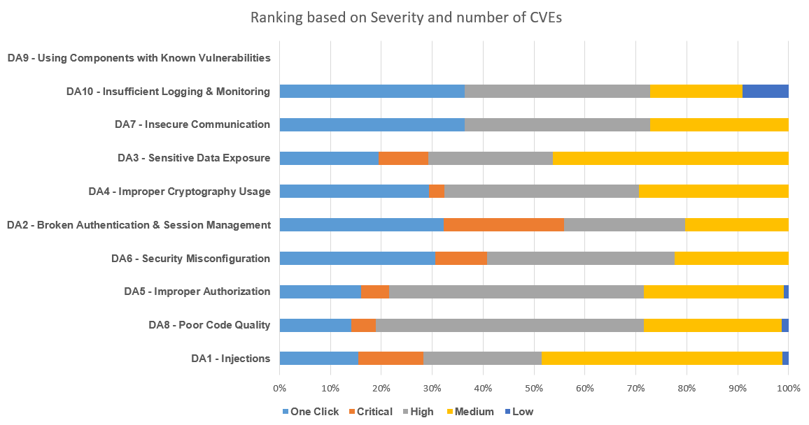

# 
# OWASP Top 10 デスクトップアプリケーションセキュリティリスク (2021) | CVE の深刻度と頻度に基づくランキング
 

ユーザー操作や特権を必要としない CVE が数多く見つかっています。発見された CVE の数とそのような問題の深刻度に基づいて、OWASP Top 10 デスクトップアプリケーション脆弱性を以下に示します。

注: 特権が必要なく、最小限のユーザー操作での重大/高の脆弱性を「OneClick」と呼ぶことにします。

| カテゴリ | One Click | 重大(Critical) | 高(High) | 中(Medium) | 低(Low) |
|---|---|---|---|---|---|
| DA1 - インジェクション (Injections) | 40 | 33 | 60 | 122 | 3 |
| DA8 - 脆弱なコード品質 (Poor Code Quality) | 32 | 11 | 120 | 62 | 3 |
| DA5 - 不適切な認可 (Improper Authorization) | 32 | 11 | 100 | 55 | 2 |
| DA6 - セキュリティの設定ミス (Security Misconfiguration) | 30 | 10 | 36 | 22 | 0 |
| DA2 - 認証とセッション管理の不備 (Broken Authentication & Session Management) | 19 | 14 | 14 | 12 | 0 |
| DA4 - 不適切な暗号化の使用 (Improper Cryptography Usage) | 10 | 1 | 13 | 10 | 0 |
| DA3 - 機密データの漏洩 (Sensitive Data Exposure) | 8 | 4 | 10 | 19 | 0 |
| DA7 - 安全でない通信 (Insecure Communication) | 4 | 0 | 4 | 3 | 0 |
| DA10 - 不十分なログ記録と監視 (Insufficient Logging & Monitoring) | 4 | 0 | 4 | 2 | 1 |
| DA9 - 既知の脆弱性を持つコンポーネントの使用 (Using Components with Known Vulnerabilities) | 0 | 0 | 0 | 0 | 0 |
 

 
注記: 

1. このランキングは、発見された CVE がデスクトップアプリケーションに関連していることを確保するために、特定のキーワードを持ち、特定のキーワードを除外する自動プロセスによって CVE から蓄積されたデータに基づいています。
2. カテゴリ「DA9 - 既知の脆弱性を持つコンポーネントの使用 (Using Components with Known Vulnerabilities)」は上の表では一致する CVE がゼロですが、これは、脆弱なコンポーネントを含むこのようなすべての脆弱性には、他のカテゴリに一致する独自の CVE が割り当てられているためです。

蓄積されたデータは2023年8月12日までのものです。
